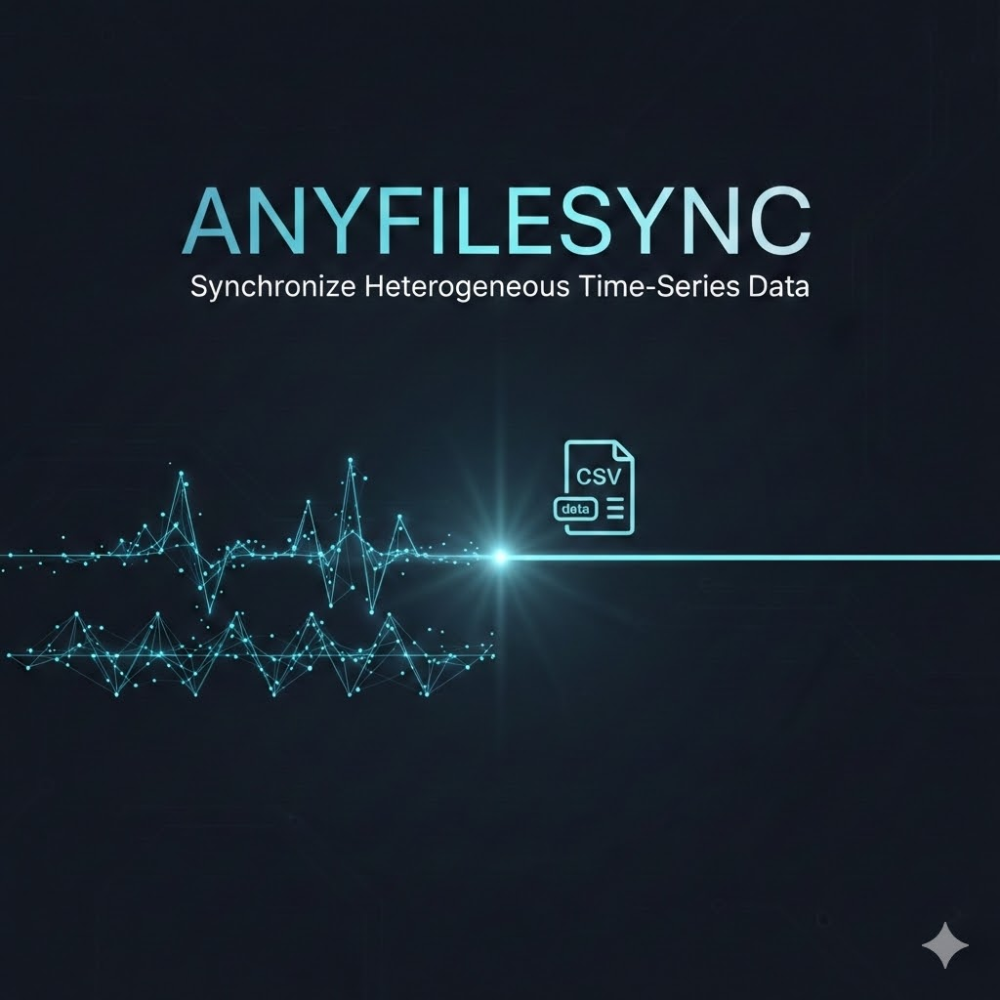
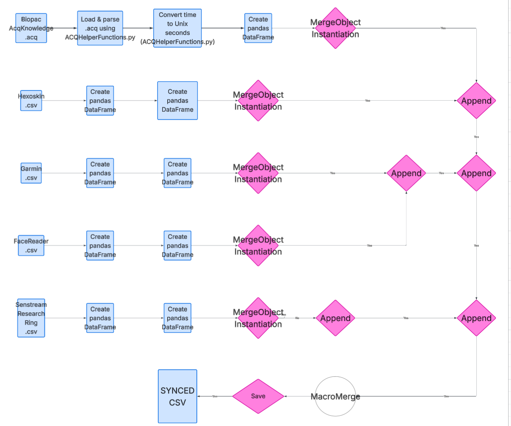

# ANYFILESYNC

## About the Project

ANYFILESYNC is a Python tool that is used to synchronize multi-modal time series data from behavioral (eye tracking, hand movement, etc.) and physiological (ECG,EDA, EMG, etc.) devices into a single CSV file, irrespective of differing sampling rates. This project was inititally developed for a research project that required many different data collection devices. It has since been adapted for general use: for anyone with some basic Python knowledge who wants to combine time series data. 

### How it Works

ANYFILESYNC enforces that the time column in each data modality refers to time in unix seconds. It then combines files using *binning*, where slower recordings are snapped to the nearest time point of faster device recordings. 

## Table of Contents

1. [About the Project](#about-the-project)
2. [Quickstart Guide](#quickstart)
3. [Technical Explanation + Architecture Diagram](#technical-specifications)
4. [Usage Examples](#usage-examples)
6. [Frequently Asked Questions (FAQ)](#frequently-asked-questions-faq)
7. [Required Dependencies](#required-dependencies)
8. [Acknowledgements & Credits](#acknowledgements--credits)

## Quickstart 

First, clone the respository for this project: 

```shell
git clone git@github.com:Ghanchu/ANYFILESYNC.git
```

Then, make sure to install all requirements necessary for this project to run 

```shell
pip install -r requirements.txt
```

## Technical Specifications


### Features, In Depth

**Acqknowledge Processing Features** - *Located in ACQHelperFunctions.py*

1. Reads Acqknowledge file headers to collect relevant metadata like sampling rate, recording channel names, and duration of study.
2. Automatically reads Acqknowledge Biodata files and converts relevant data to Pandas dataframe
3. Automatically indentifies the starting time of Acqknowledge files in Unix seconds and converts the time column in Acqknowledge to Unix seconds based on this information

**Merging Features** - *Located in mergeStruct.py*

1. Defines a MergeObject class, which is instantiated with a dataframe objects, recording UnixStartTime, recording UnixEndTime, filePath, and column headers and creates an object that is ready to merge with other MergeObjects
2. Defines a method called append in the MacroMerge class(unfinished). Append takes MergeObjects and merges them together in the *binning* method that is described in the [About the Project](#about-the-project) section.
3. Defines a method called save in the MacroMerge class(unfinished). Save exports a CSV containing all the time series data that have been appended to MacroMerge using the append method.

### Architecture Diagram



*An example of how multiple collecting devices that record different time series can be synced together*


## Usage Examples 

### 1. Parsing Through an ACQ File and Creating a MergeObject

```python
m = MacroMerge()

## example, instantiating a MergeObject that contains an acknowledge file ##

## let's say that in the future that you don't have a Acqknowleddge file, this means that you can just get rid of the Acq file in the future ##

############################################################################


# headings are what seed the pandas dataframe for this information when we need it// we are seeding the heading with time
ACQheadings:List[str] = []
ACQheadings.append("time")
ACQchannels = []
ACQchannels.append(("time", "seconds"))

# Creating the fileptr to the Acqknowledge data file
filename = input("what is the name of your Acqknowledge file? (include extensions): ")
acq = open(filename)
print("Original File Name: " + acq.readline())

# seedings headings and channels (channels are headings but with the unit added)
acq.readline()
graph_start = acq.readline()[13:].strip()
acq.readline()
count = acqGetCount(acq)
acqGetChannels(ACQchannels, count, acq, ACQheadings)

# fills the dataframe up with data
acqDF:DataFrame = acqDataFiller(count, ACQheadings, filename)

#creates the correct timeshift according to the starting unix time

acqTimepass(acqDF, graph_start)

## This final object right here is the goal, we know have an object that can begin the sync proccess along with other objects that we might add to this in the future

acqOBJ:MergeObject = MergeObject(acqDF.loc[0, "time"], acqDF.loc[len(acqDF)-1, "time"], filename, ACQheadings, acqDF)

acqOBJ.acqDF.to_csv("test.csv", sep = ',', index = False, encoding = 'utf-8')


## append the object the the MacroMerge datastructure and then continue on with your journey
m.append(acqOBJ)

```

### 2. Merging Hexoskin and Acqknowledge Data


